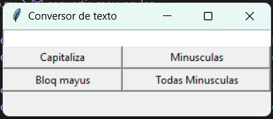
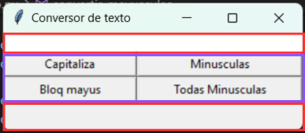

# **Calculadora de texto**


<figure style="text-align: center;">
  
  <figcaption><strong>Calculadora de texto</strong></figcaption>
</figure>

## **Índice**
1. [**Descripción**](#descripción)
2. [**Instalación**](#instalación)
3. [**Herramientas Utilizadas**](#herramientas-utilizadas)
4. [**Uso**](#uso)
5. [**Estructura del Código**](#estructura-del-código)
6. [**Requisitos**](#requisitos)
7. [**Licencia**](#licencia)
8. [**Autor**](#autor)

## **Descripción**

Calculadora para capitalizar palabras, poner todo en mayúsculas, en minúscula todo y en minúsculas la primera letra.

## **Instalación**

1. Asegúrate de tener **Python 3.12** o superior instalado en tu sistema.
2. Instala **Git** si aún no lo tienes.
3. Clona el repositorio desde GitHub con el siguiente comando:
   ```bash
   https://github.com/Mogollo7/Calculadora_de_texto.git
   ```

## **Herramientas Utilizadas**

- **Tkinter**: Biblioteca estándar para crear interfaces gráficas en Python.
- **ttk**: Módulo de Tkinter que proporciona widgets adicionales para mejorar la apariencia.

## **Uso**
En la parte superior de la calculadora, debes copiar una frase o palabra. Luego, presiona cualquier botón para que se capitalice, aplicando las transformaciones como mayúsculas, minúsculas y capitalización de la primera letra. En la parte inferior, aparecerá el resultado de la transformación realizada.

## **Estructura del Código**

<figure style="text-align: center;">
  
  <figcaption><strong></strong></figcaption>
</figure>


La interfaz se divide en dos secciones principales.

- **Labels:** En la parte superior, los labels están señalados en color rojo. En la parte inferior, también hay un label que muestra el resultado de las transformaciones.

- **Botones:** En el apartado de color morado, se encuentran cuatro botones que complementan las funcionalidades de la calculadora, permitiendo realizar diversas transformaciones de texto.

## **Requisitos**

- **Python 3.12+**
- **Tkinter** (generalmente viene preinstalado con Python en la mayoría de las distribuciones)

## **Licencia**

Este proyecto está licenciado bajo la **MIT License**.

## **Autor**

[Juan Sebastián Martínez Galeano](https://github.com/Mogollo7?tab=repositories)